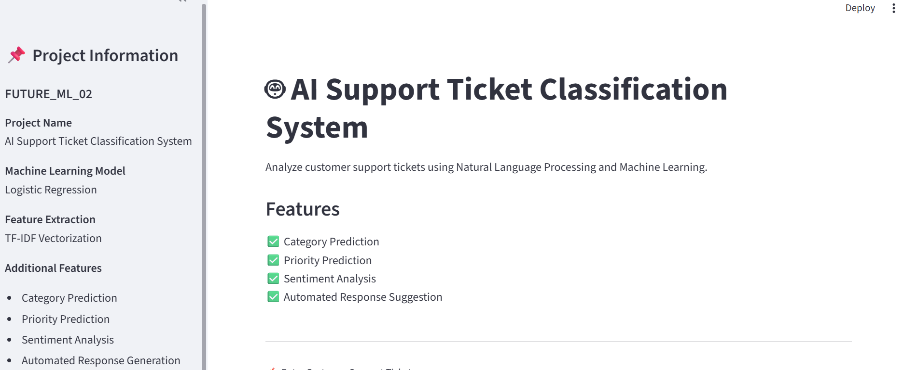
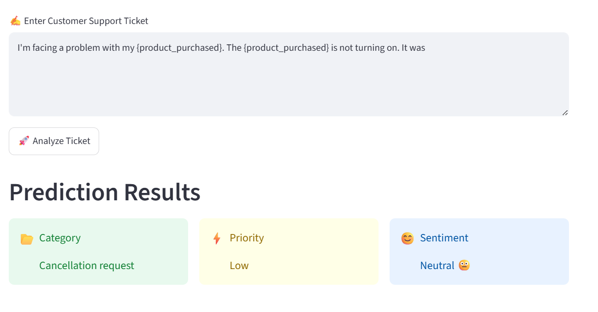
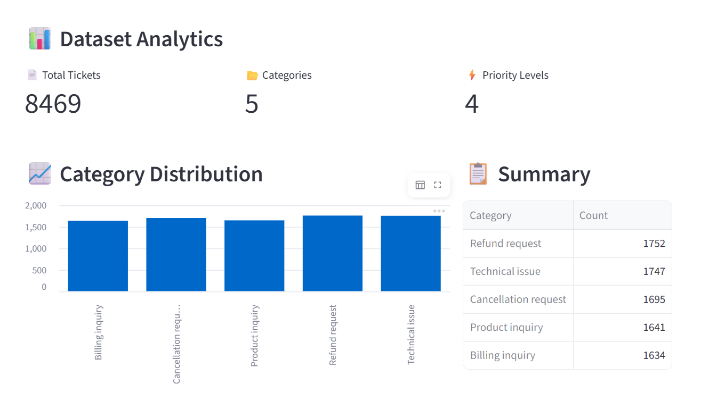

# FUTURE_ML_02

## AI Support Ticket Classification System

This project is developed as part of the Future Interns Machine Learning Internship.

The system uses Natural Language Processing (NLP) and Machine Learning techniques to automatically analyze customer support tickets and predict:

- Ticket Category
- Ticket Priority
- Customer Sentiment
- Automated Response Suggestions

---

## Project Overview

Customer support teams receive thousands of tickets daily. Manually categorizing and prioritizing tickets can be time-consuming.

This application automates the process by analyzing ticket text and generating predictions instantly.

---

## Features

✅ Support Ticket Classification

✅ Priority Prediction

✅ Sentiment Analysis

✅ Automated Response Suggestions

✅ Interactive Streamlit Web Application

✅ Dataset Analytics Dashboard

---

## Screenshots

### Home Page



### Prediction Results



### Dataset Analytics




## Installation

1. Clone Repository

git clone https://github.com/shaikkarishma23175-svg/FUTURE_ML_02.git

2. Install Dependencies

pip install -r requirements.txt

3. Run Application

streamlit run app.py


## Technologies Used

- Python
- Pandas
- NumPy
- Scikit-Learn
- NLP (TF-IDF Vectorization)
- TextBlob
- Streamlit
- Joblib

---

## Dataset

Dataset: Customer Support Tickets Dataset

The dataset contains customer support tickets with information such as:

- Ticket Type
- Ticket Priority
- Ticket Description
- Customer Information
- Resolution Details

---

## Project Structure

```text
FUTURE_ML_02/
│
├── models/
│   ├── category_model.pkl
│   ├── priority_model.pkl
│   ├── vectorizer.pkl
│
├── screenshots/
│
├── app.py
├── support_tickets.csv
├── requirements.txt
├── README.md
└── Task_2_of_Future_Interns.ipynb
